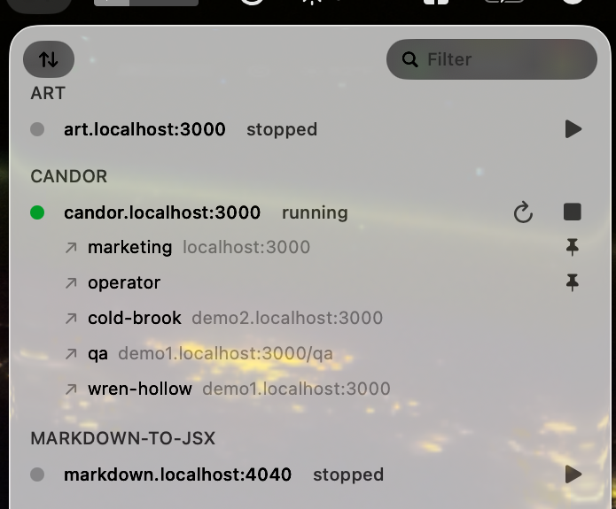

# devctl

A macOS menu bar command center for local dev servers, built so coding agents never lose track of the servers they started.



A launchd-supervised daemon owns every server process. Sessions come and go, contexts compact, terminals close: the servers, their logs, and their crash forensics stay. A CLI designed for agents (stable `--json` everywhere) and a quiet menu bar app for you sit on top of the same unix socket.

## Why

Agents forget their dev servers. After a context compaction they spawn duplicates, tail dead logs, and fight over ports. devctl gives them one idempotent verb (`devctl ensure myproj`) that always lands in the same place, a session hook that re-teaches every new or compacted session what is running, and a `why` command that turns a broken server into a root-cause diagnosis.

## Quick start

Download the latest DMG from [GitHub Releases](https://github.com/quantizor/devctl/releases) and double-click `devctl` inside it. Nothing changes until you confirm: the setup panel lists what it will do, then moves the app to Applications, installs the CLI and daemon (migrating any older `make install` copy), and offers agent hooks for Claude Code and Cursor (checked by default when needed).

Or build from source (your agent can do this for you):

```sh
make install          # CLI + daemon to ~/.local/bin, app to /Applications, daemon installed
cd your-project
devctl register --name myproj --cmd bun --cmd run --cmd dev --port 3000
devctl ensure myproj  # idempotent: healthy is a no-op
devctl why myproj     # root cause when something breaks
devctl hook install --harness cursor   # Cursor Agent sessions rediscover servers automatically
devctl hook install --harness claude   # same for Claude Code (default harness)
```

Name each server after the project (`myproj`, not a generic `web`) so it is easy to spot in Spotlight and search, and give it a `<project>.localhost` host rather than bare `localhost`: the per-project subdomain keeps browser cookies, storage, and service workers isolated between projects.

Or commit a `devservers.json` at the project root (multiple servers, dependencies, healthchecks, `*.localhost` host signatures, multi-headed proxies, lifecycle playbooks); `devctl up` brings the whole project up in dependency order. The full CLI contract lives in [docs/cli-contract.md](./docs/cli-contract.md).

## The parts

- `devctld`: the daemon. Spool-file output capture (children survive daemon restarts without SIGPIPE), process-group plus descendant-sweep teardown, health-gated phases, crash forensics, structured logs with correlation marks, a unified event feed.
- `devctl`: the CLI. `ensure`, `wait`, `up`/`down`, `logs --since-mark`, `mark`, `events`, `why`, `open`, `switch`, `lock` (pause servers sharing a resource while a test harness runs), `doctor`, and launchd management. Agents are the first-class consumer.
- `devctl.app`: the menu bar. Presence dots with counts, per-project rows with click-to-open heads (pinnable), crash notifications, a dashboard with live logs, an event timeline, and a validating config editor. Every server and head is Spotlight-searchable.

## Building

`make build` and `make test`; `make app` / `make dmg` assemble the menu bar app (and a double-click-to-install disk image) without Xcode. `scripts/smoke.sh` is the end-to-end gate. See `CLAUDE.md` for the codebase map and `CONTRIBUTING.md` for adding an agent-harness adapter and for release DMG signing secrets.
